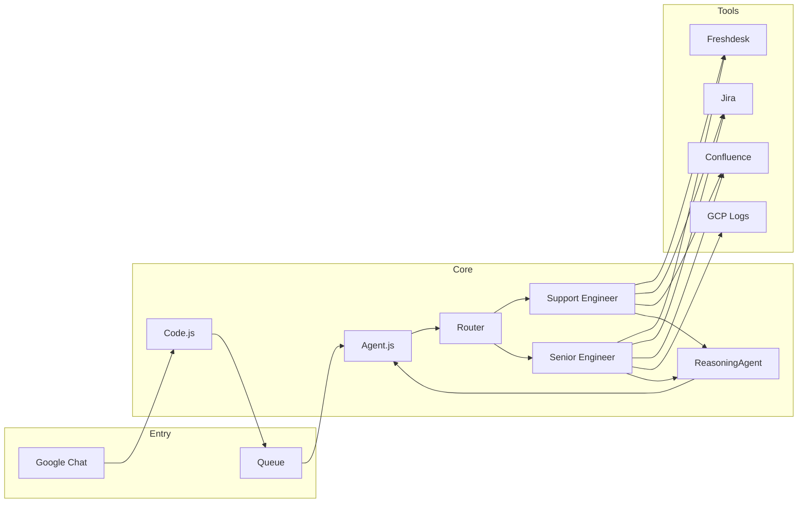

# AtlasSupportBot

A Google Chat bot (Google Apps Script) for support triage and investigation. It uses Gemini for routing and reasoning, and integrates with Freshdesk, Jira, Confluence, and GCP (logs/monitoring) to help resolve support requests.

## Overview

- **Entrypoint:** `Code.js` — Chat event handlers and queue-based async processing
- **Agents:** Support Engineer (triage/handoff) and Senior Engineer (deep technical investigation)
- **Prompts:** Stored in `.html` files and loaded via `Prompts.js`
- **Tools:** Freshdesk, Jira, Confluence, GitHub, GCP Logs/Monitoring (see `Tool*.js`)

### Architecture

## Setup

1. Deploy as a Google Apps Script project (e.g. with [clasp](https://github.com/google/clasp)).
2. Configure script properties: `GEMINI_API_KEY`, Jira/Confluence/Freshdesk credentials, `GITHUB_TOKEN`, etc. (see `Config.js`).
3. Install the polling trigger once: `installPollingTrigger()` for queue processing.

## Development

- Prompts live in `.html` files; do not add long prompt strings in `.js` (see `.cursor/rules/prompts_in_html.mdc`).
