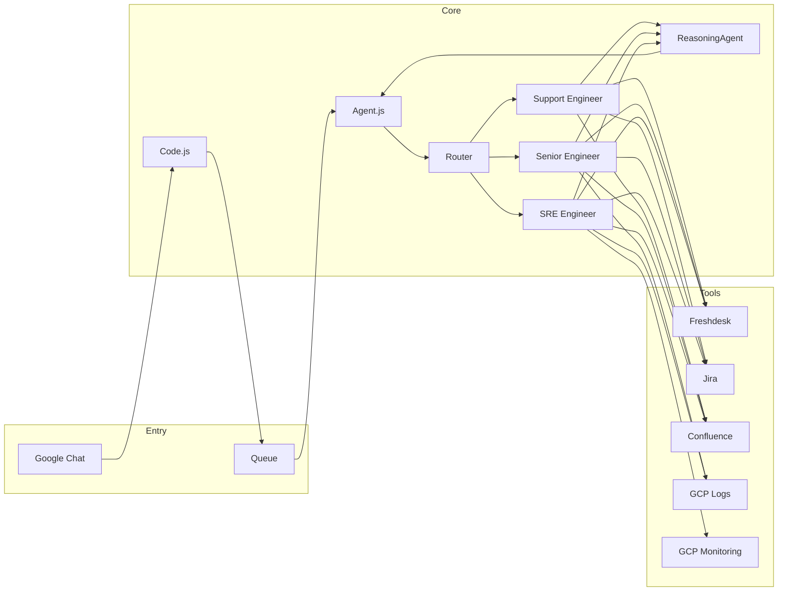

# AtlasSupportBot

A Google Chat bot (Google Apps Script) for support triage and investigation. It uses **Gemini** for routing and reasoning, and integrates with **Freshdesk**, **Jira**, **Confluence**, **GitHub**, and **GCP** (Cloud Logging & Monitoring) to help resolve support requests.

## Overview

- **Entrypoint:** `Code.js` — Chat event handlers and queue-based async processing (1‑minute polling).
- **Agents:** Three research personas selected by an LLM router:
  - **Support Engineer (Alex)** — Triage and handoff; Confluence, Jira, Freshdesk (no logs or GitHub).
  - **Senior Engineer (Sam)** — Deep technical investigation; full tool set including GCP logs and GitHub.
  - **SRE Engineer (Riley)** — Infrastructure and incident investigation; same as Sam plus K8s events, FluxCD deployment events, pod discovery, and Cloud Monitoring metrics.
- **Orchestration:** Router → selected agent researches → **ReasoningAgent** (QA) evaluates; loop until satisfied or max rounds, then final responder (with optional Jira ticket creation for authorized users).
- **Prompts:** Stored in `.html` files and loaded via `Prompts.js` (see [Project structure](#project-structure)).
- **Requester context:** Department/team from BigQuery (`bob_employee`) to tailor persona hints and ticket policy; optional, falls back to "Other" if unavailable.

### Architecture

## Project structure

| File | Purpose |
|------|--------|
| `Code.js` | Chat `onMessage` handler; enqueues messages; `processQueue` (triggered every 1 min); `installPollingTrigger()` |
| `Config.js` | Script properties (Gemini, Jira, Confluence, Freshdesk, GitHub), whitelist, `isThinkingModeEnabled()` |
| `Prompts.js` | Loads prompts from `.html`; `buildSystemPrompt(senderEmail)`, `getPromptFromHtml(basename)` |
| `Agent.js` | Orchestrator: conversation summary, optional thinking-mode rewrite, router, research loop, ReasoningAgent, responder |
| `SupportEngineerAgent.js` | Alex — triage/handoff (Support Engineer tools only) |
| `SeniorEngineerAgent.js` | Sam — full search + GCP logs + GitHub |
| `SREAgent.js` | Riley — full search + K8s/FluxCD events, pod discovery, Cloud Monitoring |
| `ReasoningAgent.js` | QA: evaluates whether findings answer the question; can request clarification or more rounds |
| `ThinkingAgent.js` | Optional query rewrite before the main agent (controlled by `THINKING_MODE`) |
| `RequesterContext.js` | BigQuery lookup + cache for requester department/team; persona (TechOps, Engineering, Other) |
| `ToolRegistry.js` | Gemini function declarations: Support Engineer, Senior (search + gcloud + github), SRE (+ k8s, monitoring), action (e.g. `jira_create_issue`) |
| `Gemini.js` | Gemini API client (native function calling) |
| `ToolConfluence.js` | Confluence search, get page, get page children |
| `ToolJira.js` | Jira projects, boards, sprints, search, discover fields, get issue, create issue |
| `ToolFreshdesk.js` | Freshdesk ticket, conversations, search by requester |
| `ToolGitHub.js` | GitHub search (org-scoped) |
| `ToolGCloudLogs.js` | Cloud Logging log queries |
| `ToolKubernetes.js` | K8s pod events, deployment events, discover pods (via Cloud Logging) |
| `ToolGCloudMonitoring.js` | **GCP Monitoring:** container restart count, CPU/memory/uptime metrics, restart count across all containers in an environment (SRE agent only) |
| `ChatHelpers.js` | Reply in thread, strip bot mention, thread history |
| `Debug.js` | `debugLog(tag, message, detail)`, `firstNWords()` for safe logging |

**Prompts (`.html`):** `SystemPrompt`, `AgentRouterPrompt`, `SupportEngineerPrompt`, `SeniorEngineerPrompt`, `SREAgentPrompt`, `ReasoningPrompt`, `ThinkingPrompt`, `ConversationSummaryPrompt`, `SearchAgentPrompt` (legacy).

## Configuration

**Script properties** (set via Apps Script: File → Project properties → Script properties, or run `setupProperties()` after filling values):

| Property | Required | Description |
|----------|----------|-------------|
| `GEMINI_API_KEY` | Yes | Gemini API key |
| `JIRA_URL` | Yes | Jira base URL |
| `JIRA_USERNAME` | Yes | Jira user for API |
| `JIRA_API_TOKEN` | Yes | Jira API token |
| `CONFLUENCE_URL` | Yes | Confluence base URL |
| `FRESHDESK_API` | Yes | Freshdesk API key (Basic auth) |
| `FRESHDESK_DOMAIN` | Yes | e.g. `https://oviva.freshdesk.com` |
| `GITHUB_TOKEN` | Yes | GitHub personal access token |
| `GITHUB_ORG` | Yes | GitHub organization name |
| `THINKING_MODE` | No | Set to `false` or `0` to disable query rewrite; default enabled |
| `BQ_PROJECT_ID` | No | BigQuery project for requester context (default: `data-warehouse-prod-308513`) |

**Whitelist:** Only whitelisted users can use the bot (POC). Edit `WHITELISTED_USERS` in `Config.js`. One user (`AUTHORIZED_EMAIL`) can create Jira tickets via the bot.

**Advanced services:** Enable in Apps Script (Resources → Advanced Google Services): **Google Chat API**, **BigQuery API**.

## Setup

1. **Deploy** as a Google Apps Script project (e.g. with [clasp](https://github.com/google/clasp)).
2. **Configure** script properties (see [Configuration](#configuration)). Run `setupProperties()` once to validate.
3. **Install the polling trigger** once: in the script editor run `installPollingTrigger()`. This creates a time-driven trigger that runs `processQueue` every 1 minute.
4. **Connect** the script to Google Chat (configure the Chat app to use the deployed web app URL or the Apps Script deployment).

## Deployment

Deploy with clasp: `clasp push` then update the **existing** deployment (do not create a new one, or the Chat app configuration will break). See [.cursor/rules/clasp_deploy.mdc](.cursor/rules/clasp_deploy.mdc) for the exact deploy command and deployment ID.

## Development

- **Prompts:** All prompt text lives in `.html` files. Do not add long prompt strings in `.js`. See [.cursor/rules/prompts_in_html.mdc](.cursor/rules/prompts_in_html.mdc).
- **Debug:** `debugLog(tag, message, detail)` in `Debug.js` logs to the Apps Script execution log (prefix `[DEBUG]`). Used for router, orchestrator, tool calls, and LLM requests.
- **Model:** `Config.GEMINI_MODEL` (e.g. `gemini-2.5-pro`). Orchestrator rounds and search iterations are in `Config.js` (`MAX_ORCHESTRATOR_ROUNDS`, `MAX_SEARCH_ITERATIONS`).
